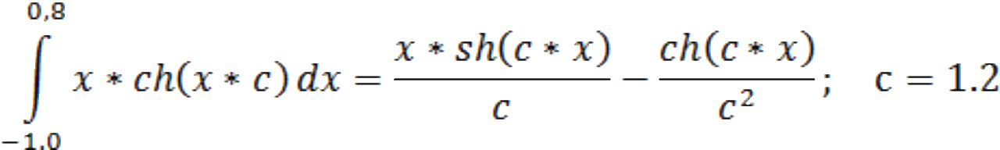

## Параллельное программирование
## Лабораторная работа 1
## Вариант 20i

# ОСНОВНЫЕ ФУНКЦИИ MPI.


### Функция для интегрирования № 20:
```c
a = -1.0, b = 0.8, c = 1.2
```

### ~~фээээ а чё не латех~~

## Цель работы
Освоить применение основных функций MPI на примере параллельной программы численного интегрирования.

## Лабораторное задание
1. Создать в домашнем каталоге папку для лабораторной работы 1. Скопировать в него из каталога pub (ссылка в домашнем каталоге) папку INTEG, содержащую две программы: integi.c,  integn.c и файл конфигурации кластера nodes.

2. Для указанной преподавателем программы получить загрузочный модуль и проверить работоспособность программы в режиме последовательного и параллельного выполнения на разном числе процессов. Какой метод численного интегрирования используется в программе?.

3. Разобраться в MPI функциях, используемых в программе. Определить назначение и типы параметров функций. Какие дополнительные функции, кроме шести основных используются в программе?

4. Скопировать программу в новый файл. Произвести замену подынтегральной и первообразной функции на указанные преподавателем функции двух переменных. В программе задать значения переменных для пределов интегрирования и параметра математической функции.

5. Получить загрузочный модуль программы и выполнить его на различном числе процессов. Результаты программы направлять переназначением стандартного вывода в файлы результатов.

6. Скопировать программу с индивидуальной функцией в новый файл. Заменить индивидуальные функции передачи и приема на коллективные функции MPI_Bcast и MPI_Reduce. Выполнить программу с числом процессов, выбранных в п. 5.

7.  Скопировать программу п. 6 в другой файл. Заменить в программе назначения пределов интегрирования и параметра функции на ввод их с терминала. Ввод провести в нулевом процессе. Упаковать введенные с терминала пределы интегрирования и параметр функции в буфер, разослать буфер всем процессам и распаковать (функции MPI_Pack и MPI_Unpack). Отладить и выполнить новую программу с тем же набором числа процессов и вводимых данных как в п.5.

8. Провести анализ времен выполнения всех трех программ. Какие выводы и рекомендации можно сделать из этого анализа?

## Содержание отчета

В отчет включить:
*  цель работы;
*  индивидуальное задание (функции);
*  полный текст последнего варианта программы для индивидуальной математической функции, коллективными функциями передачи, вводом исходных данных и рассылкой их всем процессам с применением операций упаковки-распаковки (последний вариант);
*  перечень использованных в программе  функций MPI;
*  результаты работы программ п. 5, 6, 7. Для п.6, 7 для можно привести таблицу значений времен выполнения программ с указанием числа процессов.

## Методические указания

В программу с использованием функций MPI необходимо включить директиву – 
`#include <mpi.h>`

Для обработки программы используется  компилятор gcc с оболчкой для MPI – mpicc.

Так для программы myprog.c следует выполнить команду
`mpicc –o myprog –lm myprog.c` 
Ключи и режимы программы такие же, как в программе gcc.

Для запуска программы с использованием MPI достаточно воспользоваться командой 
`mpirun –np <число процессов>  [-hostfile <имя_файла>]  ./<имя программы>`

Ключ hostfile передает имя файла конфигурации кластера. В лабораторной работе это файл nodes. Если ключ `–hostfile` не использовать, все процессы будут выполняться на главном узле кластера.

Для проверки алгоритма программы ее можно выполнить в однопроцессорном режиме обычной командой – `./<имя программы>`

## Приложение А/Б
см. [integi](src/ext/integi.c) и [integn](src/ext/integn.c)


# ВАЖНО
## 3-gonna-метрия
В задании | В math.h | Что это вообще
--- | --- | ---
sh | sinh | Гиперболический синус
ch | cosh | Гиперболический косинус
th | tanh | Гиперболический тангенс
cth | 1/tanh | Гиперболический котангенс
sech | 1/cosh | Гиперболический секанс
csch | 1/sinh | Гиперболический косеканс

