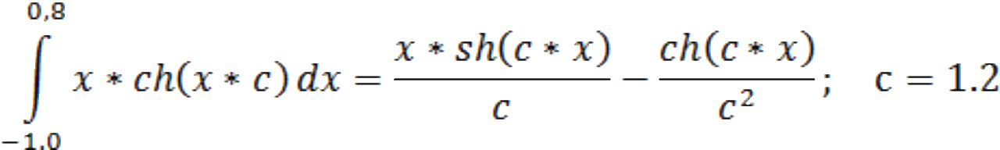

## Параллельное программирование
## Лабораторная работа 4
## Вариант 20i

# ОБРАБОТКА И ВЫПОЛНЕНИЕ ПРОГРАММ В СРЕДЕ OpenMP

### Функция для интегрирования № 20:
```c
a = -1.0, b = 0.8, c = 1.2
```

### ~~фээээ а чё не латех~~
## Цель работы
Освоить применение основных директив, функций и переменных окружения OpenMP на примере параллельной программы численного интегрирования.

## Лабораторное задание

1. Последнюю программу лабораторной работы вычисления интеграла: integi.c или integn.c. скопировать в новый файл.

2. Проанализировать функции MPI для включении аналогичных директив и функций OpenMP в программу.

3. Убрать из программы функции MPI  и сделать последовательную программу. Отметить места функций MPI для последующего включения аналогичных конструкций OpenMP.

4. Получить загрузочный модуль и выполнить последовательную программу. Проверить совпадение результатов с параллельной программой.

5. Спланировать параллельные регионы программы. Определить набор общих и локальных переменных. Назначить переменную для редукции.

6. Добавить в программу директивы parallel и for с необходимыми параметрами и типами переменных. Распределение итераций цикла не планировать. Полученные в отдельных потоках частные суммы собрать  переменной редукции в общую сумму для значения интеграла.

7. Обработать и выполнить параллельную программу OpenMP с числом процессов, установленных в системе.

8. Включить в программу функции OpenMP и вывести значения переменных        интерфейса:
    максимально возможное число потоков - omp_get_max_threads(),
    установка числа потоков в параллельной области - omp_set_num_threads(n) ,
    определение числа потоков в параллельной области - omp_get_num_threads(),
    номер каждого потока параллельного региона - omp_get_threads_num(),
    время работы программы - omp_get_wtime().

    Определение числа потоков в параллельной области должно выполняться в главном потоке параллельной области (в директиве master).

9. Включить в директиву FOR параметр распределения итераций (schedule). Размер блока итераций (chunk) выбрать таким, чтобы в каждом потоке выполнялось несколько частей итераций цикла. Сравнить время выполнения программы в статическом (static) и динамическом (dynamic) режимах.

10. Доработать программу назначением числа нитей параллельной части программы параметром командной строки при запуске программы.

11. Выполнить программу для разного числа нитей и записи результатов в текстовые файлы. Попробуйте менять значения параметра распределения итераций в цикле.

## Содержание отчёта 

В отчет включить:
*  цель работы;
*  индивидуальное задание (функции);
*  полный текст параллельной программы  с функциями OpenMP;
*  перечень использованных в программе директив и функций OpenMP;
*  результаты работы программы для различного числа потоков, способов планирования итераций цикла и точности вычислений. 


## Приложение А
см.
[omp.c](src/ext/omp.c)

## Используемые директивы и функции OpenMP

* ```c
    #include <omp.h> 
    // подключить библиотеку OpenMP;
* ```c
    #pragma omp parallel shared(a,b,c,n,chunk) private(I,x, Sum, myid) reduction(+:Gsum) 
    // создать группу из нескольких потоков, выполняющих одну и ту же операцию, храня в каждом потоке копию переменной Gsum;
* ```c
    #pragma omp master 
    // выполнить данную область извсех потоков в первую очередь;
* ```c
    #pragma omp for  schedule(static, chunk) 
    // распределить работу программы на все известное число потоков;
* ```c
    omp_get_wtime() 
    // получить время для засекания работы программы;
* ```c
    omp_get_max_threads() 
    // получить максимальное число возможных потоков;
* ```c
    omp_get_thread_num() 
    // определить номер потока;
* ```c
    omp_set_num_threads(nt) 
    // использовать nt потоков в параллельной области.

## Сборка и запуск
* ```shell
    gcc <srcname> -lm -fopenmp -o <outname>
* ```shell
    ./outname <threads>
* ~~Хлопай ресницами и взлетай~~


